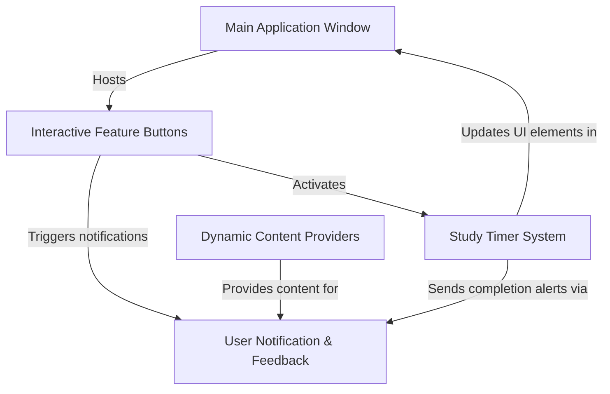

# Tutorial: my-python-studybudy

This project, `my-python-studybudy`, is a *friendly virtual assistant* designed to help you stay **focused and motivated** during your study sessions. It's a simple *desktop application* that provides quick access to study reminders, inspirational quotes, helpful tips, and even a dedicated **study timer** to manage your time effectively.


## Visual Overview



## Chapters

1. [Main Application Window
](01_main_application_window_.md)
2. [Interactive Feature Buttons
](02_interactive_feature_buttons_.md)
3. [Study Timer System
](03_study_timer_system_.md)
4. [User Notification & Feedback
](04_user_notification___feedback_.md)
5. [Dynamic Content Providers
](05_dynamic_content_providers_.md)

---

<sub><sup>Generated by [AI Codebase Knowledge Builder](https://github.com/The-Pocket/Tutorial-Codebase-Knowledge).</sup></sub>
# Chapter 1: Main Application Window

Welcome to your first step in building the `my-python-studybudy`! Every great journey starts with a first step, and for our app, that first step is creating its main window.

### Why do we need a "Main Application Window"?

Imagine you have a real study desk. It's the central place where you put your books, pens, and perhaps a cup of coffee. You do all your studying *on* or *at* this desk.

Our Virtual Study Buddy app is very similar! It needs a main "desk" on your computer screen. This "desk" is what we call the **Main Application Window**. It's the first thing you see when you open the app, and it's where everything else will live: your reminder buttons, your study timer, motivational quotes, and more!

Without this main window, there's no place for our app to show itself or for you to interact with it. It's the foundation of our entire application.

### Creating Our App's "Desk": The Main Window

Let's break down how we create this digital desk using Python. We'll use a special toolkit called `tkinter` (pronounced "tee-kay-inter"), which helps us build graphical user interfaces (GUIs), or what you typically think of as apps with buttons and windows.

#### Step 1: Getting Our Building Tools Ready

First, we need to tell Python that we want to use the `tkinter` toolkit. It's like opening your toolbox before you start building something.

```python
import tkinter as tk
```

*   `import tkinter`: This line brings the `tkinter` library into our program.
*   `as tk`: This just gives `tkinter` a shorter, easier name (`tk`) so we don't have to type `tkinter` every time we use one of its tools.

#### Step 2: Laying Out the "Desk"

Now that we have our tools, let's create the actual main window. This is like setting up a blank desk.

```python
# This creates the main window object for our app
root = tk.Tk()
```

*   `tk.Tk()`: This is the command from `tkinter` that creates the top-level (main) window of our application.
*   `root =`: We store this window in a variable named `root`. `root` is a common name for the main window in `tkinter` apps.

#### Step 3: Making Our Desk Look Nice

A blank desk is okay, but we want our study buddy's desk to be inspiring! We can customize its title, size, and even its background color.

```python
root.title("🌟 Virtual Study Buddy 🌟") # Sets the text at the top of the window
root.geometry("420x500")       # Sets the window's size (width x height)
root.configure(bg="#f0f8ff")   # Sets the background color to a light blue
```

*   `root.title(...)`: This sets the text that appears in the title bar at the very top of your application window.
*   `root.geometry("420x500")`: This command sets the initial size of our window. It means the window will be 420 pixels wide and 500 pixels tall.
*   `root.configure(bg="#f0f8ff")`: This changes the background color of our window. `#f0f8ff` is a special code for a light, calming blue color. You can experiment with other color codes if you like!

#### Step 4: Turning on the Power!

We've designed our desk, but it won't appear on screen or respond to anything until we "turn it on."

```python
root.mainloop() # This starts the app and keeps it running
```

*   `root.mainloop()`: This is a very important line! It tells `tkinter` to start listening for events (like mouse clicks or keyboard presses) and to keep the window open and visible until you close it. Think of it as plugging in your desk lamp and turning it on – without it, your desk would be in the dark!

If you put all these pieces together in a Python file and run it, you will see a window pop up on your screen with the title "🌟 Virtual Study Buddy 🌟", a light blue background, and a size of 420x500 pixels! Try it!

### How Does it Work Behind the Scenes?

When you run your Python script, a few things happen very quickly to bring your application window to life:


*   **You start the script:** Your computer runs the Python code you've written.
*   **Python asks Tkinter:** Your `import tkinter as tk` and `root = tk.Tk()` lines tell `tkinter` to prepare a new window.
*   **Tkinter talks to your Operating System (OS):** `tkinter` then communicates with your computer's OS (like Windows, macOS, or Linux) and asks it to create a brand new application window on your screen.
*   **The OS creates the window:** The OS does the heavy lifting, drawing the window, its title bar, and its minimize/maximize/close buttons.
*   **Properties are set:** Your `root.title()`, `root.geometry()`, and `root.configure()` commands tell `tkinter` to instruct the OS to change how this new window looks.
*   **The "Event Loop" starts (`root.mainloop()`):** This is where the app truly comes alive. `tkinter` continuously checks if you've clicked a button, typed something, or tried to close the window. It keeps the window visible and responsive. When you click the close button, `mainloop()` detects this and tells the app to shut down.

Let's look at the relevant parts from our project's `ai study buddy/Main.py` file:

```python
# --- File: ai study buddy/Main.py ---
import tkinter as tk # (1) Import our toolkit
from tkinter import messagebox
import random
import threading
import time

# ----------------- Main Window -----------------
root = tk.Tk()                       # (2) Create the main window object
root.title("🌟 Virtual Study Buddy 🌟") # (3) Set the title
root.geometry("420x500")             # (4) Set the size
root.configure(bg="#f0f8ff")         # (5) Set the background color

# ... (other app elements like buttons and labels go here) ...

# ----------------- Run the App -----------------
root.mainloop() # (6) Start the app and make the window appear
```

The lines marked with numbers (1) through (6) are the core pieces that create and manage our Main Application Window. All the other code in `Main.py` adds things *inside* this `root` window.

### Conclusion

You've just learned the absolute first step in creating any graphical application: setting up its main window! This window (`root`) acts as our study desk, providing the space for all our other exciting features. You now know how to create it, give it a title, set its size, change its background, and most importantly, make it appear and stay on screen.

Next, we'll learn how to place useful tools on this desk, starting with how to create interactive buttons for our study buddy!

[Next Chapter: Interactive Feature Buttons](02_interactive_feature_buttons_.md)

---
# Chapter 2: Interactive Feature Buttons

Welcome back, future Pythonista! In [Chapter 1: Main Application Window](01_main_application_window_.md), we learned how to create the main "desk" for our `my-python-studybudy` app. It's the foundation, the blank canvas where all our awesome features will live.

Now, imagine your physical study desk again. A desk is great, but it's not very useful if it's just empty. You need tools on it – pens, paper, a lamp, maybe a calculator. Our virtual study desk (the main window) also needs tools! How do we put things like a "Get Reminder" button or a "Get Motivation" button on it so you can actually *do* something?

### Why do we need "Interactive Feature Buttons"?

Our app isn't just a pretty window; it's a helpful companion! To make it helpful, you need to be able to tell it what you want. Do you need a study reminder right now? A quick motivational boost? Or perhaps a clever study tip?

This is where **Interactive Feature Buttons** come in!

Think of them as the app's control panel. Each button is a clickable control that, when pressed, triggers a specific action.
*   Click "Get Reminder" and boom, a reminder pops up!
*   Click "Get Motivation" and you instantly get an uplifting message!
*   Click "Get Study Tip" and a helpful tip appears!

These buttons are the primary way you'll interact with our app, making it super easy to access all its cool features with just a single click.

### Creating Our App's "Tools": The Buttons

Let's learn how to add these interactive buttons to our `root` window. We'll continue using our `tkinter` toolkit.

#### Step 1: Decide What Your Button Will *Do*

Before we create a button, we need to know what action it should perform when clicked. In programming, a specific set of instructions that performs a task is called a **function**.

Let's define a simple function that will show a reminder message.

```python
import tkinter as tk # We'll need this again for Tkinter tools
from tkinter import messagebox # Special tool to show pop-up messages

def study_reminder():
    # This is the action that happens when the button is clicked
    messagebox.showinfo("Reminder", "⏰ Time to study! 💪")
```

*   `from tkinter import messagebox`: This line imports a special part of `tkinter` that lets us create simple pop-up message boxes. Very handy for giving feedback!
*   `def study_reminder():`: This is how you define a function in Python. `study_reminder` is the name of our function, and the code indented below it is what the function *does*.
*   `messagebox.showinfo(...)`: This command displays a pop-up window. The first string ("Reminder") is the title of the pop-up, and the second string ("⏰ Time to study! 💪") is the message inside.

#### Step 2: Designing the Button

Now that we have a function ready, let's create the actual button that will call this function.

```python
# Assume 'root' is our main window from Chapter 1
# root = tk.Tk()
# root.title("🌟 Virtual Study Buddy 🌟") # ... etc.

reminder_button = tk.Button(
    root,
    text="📝 Get Reminder", # What text is shown on the button
    command=study_reminder  # What function to run when clicked
)
```

*   `tk.Button(...)`: This is the `tkinter` command to create a new button.
*   `root`: The first thing we tell `tk.Button` is *where* it should appear. In our case, it should appear inside our `root` (main application window).
*   `text="📝 Get Reminder"`: This sets the text label that will be displayed on the button. You can put emojis here too!
*   `command=study_reminder`: **This is the magical part!** We tell the button, "When someone clicks me, please run the `study_reminder` function." Notice we *don't* put parentheses `()` after `study_reminder` here. We are giving the button the function itself, not asking it to run the function right away.

#### Step 3: Placing the Button on the Desk

Just like you put a book on your desk, we need to tell our button where to go inside our `root` window.

```python
# After creating the button:
# reminder_button = tk.Button(...)

reminder_button.pack(pady=10) # Place the button in the window
```

*   `reminder_button.pack(pady=10)`: The `pack()` method is a simple way to arrange widgets (like buttons) in `tkinter`. It "packs" them into the window one after another. `pady=10` adds 10 pixels of empty space (padding) above and below the button, so it's not squished against other elements.

### Putting It All Together (Minimal Example)

If you combine these steps, here's a very simple program that creates a window and a clickable reminder button:

```python
import tkinter as tk
from tkinter import messagebox

# Our main window (from Chapter 1)
root = tk.Tk()
root.title("My Button App")
root.geometry("300x200")

# The function our button will call
def show_a_message():
    messagebox.showinfo("Hello!", "You clicked the button!")

# Create the button
my_button = tk.Button(
    root,
    text="Click Me!",
    command=show_a_message
)

# Place the button in the window
my_button.pack(pady=50) # Add some vertical padding

# Start the app (from Chapter 1)
root.mainloop()
```

If you run this code, you'll see a small window with a "Click Me!" button. When you click it, a pop-up message saying "You clicked the button!" will appear! This is the core idea behind all our interactive buttons.

### How Does it Work Behind the Scenes?

When you click a button in your `tkinter` application, here's a simplified look at what happens:

```mermaid
sequenceDiagram
    participant You: Your Computer User
    participant App Window: Your Tkinter App
    participant Tkinter: Python's UI Toolkit
    participant My Function: Your Python Code (e.g., study_reminder)

    You->>App Window: Click "Get Reminder" Button
    App Window->>Tkinter: "User clicked the button named 'reminder_button'!"
    Tkinter->>Tkinter: Looks up the 'command' associated with 'reminder_button'
    Tkinter->>My Function: "Hey, 'study_reminder' function, time to run!"
    My Function->>Tkinter: "I need to show a message box with 'Time to study!'"
    Tkinter->>App Window: Displays the message pop-up
    App Window->>You: You see the "Reminder" message!
```

*   **You Click:** You interact with the graphical element (the button) on your screen.
*   **Tkinter Detects:** The `root.mainloop()` (which we learned about in [Chapter 1: Main Application Window](01_main_application_window_.md)) is constantly "listening" for such events. It detects that the button was clicked.
*   **Command Lookup:** `tkinter` knows that `reminder_button` was created with `command=study_reminder`. It remembers which Python function is linked to that specific button.
*   **Function Execution:** `tkinter` then calls, or "executes," the `study_reminder` function.
*   **Function Does Its Job:** Our `study_reminder` function then uses `messagebox.showinfo` (another `tkinter` tool) to create and display the pop-up message.
*   **You See the Result:** The message box appears on your screen, giving you the reminder!

### Looking at Our `Main.py` Buttons

Our `ai study buddy/Main.py` file uses this exact same pattern to create all its interactive buttons. Let's look at a couple of examples:

#### 1. The Reminder Button

```python
# --- File: ai study buddy/Main.py ---
# ... (imports and root window setup) ...

# ----------------- Reminder Button -----------------
def study_reminder(): # (1) Define the function
    messagebox.showinfo("Reminder", "⏰ Time to study! 💪")

reminder_button = tk.Button( # (2) Create the button
    root,
    text="📝 Get Reminder",
    command=study_reminder,  # (3) Link the function
    font=("Arial", 14),
    fg="white",
    bg="#32cd32",  # Lime green
    width=20,
    height=2
)
reminder_button.pack(pady=10) # (4) Place the button
```

This is exactly what we discussed!
1.  We define `study_reminder`.
2.  We create `reminder_button` inside `root`.
3.  We connect `study_reminder` to the `command` attribute.
4.  We `pack` it onto the window.

You'll notice our `Main.py` adds a few more details to `tk.Button` to make it look nicer:
*   `font=("Arial", 14)`: Changes the text font and size.
*   `fg="white"`: Sets the foreground color (text color) to white.
*   `bg="#32cd32"`: Sets the background color of the button to a specific green. `#32cd32` is a hex code for "Lime Green."
*   `width=20`, `height=2`: Sets the button's size in characters (width) and lines (height).

#### 2. The Motivation Button

The motivation button works in the same way!

```python
# --- File: ai study buddy/Main.py ---
# ... (imports and root window setup) ...

# ----------------- Motivation Button -----------------
quotes = [ # (1) A list of motivational quotes
    "✨ You can do it! ✨",
    "💡 Keep going, success is near!",
    # ... more quotes ...
]

def show_motivation(): # (2) Function to pick a random quote
    messagebox.showinfo("Motivation", random.choice(quotes))

motivation_button = tk.Button( # (3) Create the button
    root,
    text="💡 Get Motivation",
    command=show_motivation,  # (4) Link the function
    font=("Arial", 14),
    fg="white",
    bg="#1e90ff",  # Dodger blue
    width=20,
    height=2
)
motivation_button.pack(pady=10) # (5) Place the button
```

Here, the `show_motivation` function uses `random.choice(quotes)` to pick one motivational message from the `quotes` list each time you click the button. But the core concept – defining a function and linking it to a button's `command` – remains identical!

#### Summary of Our Main Buttons

| Button Text           | What it Does (Function) | Appearance (Key Attributes)        |
| :-------------------- | :---------------------- | :--------------------------------- |
| `📝 Get Reminder`     | Shows a study reminder  | `bg="#32cd32"` (Lime Green)        |
| `💡 Get Motivation`   | Shows a random quote    | `bg="#1e90ff"` (Dodger Blue)       |
| `📖 Get Study Tip`    | Shows a random study tip | `bg="#ff69b4"` (Hot Pink)          |
| `▶️ Start 3 Hour Timer` | Starts a study timer    | `bg="#ff8c00"` (Orange)            |

Each of these buttons follows the same fundamental principle: define a Python function that performs an action, then create a `tk.Button` and assign that function to its `command` attribute.

### Conclusion

You've successfully added functionality to your app! You now understand how to create interactive buttons, define the actions they perform using Python functions, and place them within your main application window. These interactive buttons are fundamental to making your app user-friendly and functional.

Next, we'll dive into how one of these buttons, the "Start 3 Hour Timer," actually works to help you manage your study sessions!

[Next Chapter: Study Timer System](03_study_timer_system_.md)

---
# Chapter 3: Study Timer System

Welcome back, future Pythonista! In [Chapter 2: Interactive Feature Buttons](02_interactive_feature_buttons_.md), we empowered our `my-python-studybudy` app with clickable buttons that perform actions like giving reminders and motivational quotes. Now, let's dive into one of the most powerful features: the **Study Timer System**.

### Why do we need a "Study Timer System"?

Have you ever sat down to study, only to find your mind wandering after a few minutes? Or perhaps you've lost track of time, studying for too long and feeling burnt out? This is a common challenge!

Our **Study Timer System** is like having a specialized, super-smart stopwatch for your study sessions. Its main job is to help you:
1.  **Focus:** It counts down for a set duration, encouraging you to concentrate during that time.
2.  **Track Progress:** It keeps a tally of how many study sessions you've completed, giving you a sense of achievement.
3.  **Stay Responsive:** Unlike a regular timer that might freeze your app, our timer runs in the background. This means you can still click other buttons or interact with the app while your study time is ticking away!

It's the core time-management feature designed to help you build good study habits and make your study sessions more effective.

### The Timer's Heartbeat: Counting Down

Let's look at the heart of our timer: the part that actually counts down the seconds. Imagine you have a digital clock. Every second, the numbers change. How do we make our computer do that?

We'll use a `while` loop, which keeps running as long as a certain condition is true, and a special command `time.sleep()` to pause our program for one second.

#### Step 1: Getting Our Time Tools Ready

We need to `import` a couple of tools for time and for running things in the background.

```python
import time      # For pausing our program
import threading # For running tasks in the background
```

*   `import time`: This gives us functions related to time, especially `time.sleep()`.
*   `import threading`: This is for the "running in the background" magic, which we'll explore soon.

#### Step 2: The Countdown Function

This function will do the actual counting down.

```python
import time # Needed for time.sleep()

def countdown(seconds):
    while seconds > 0:
        # Calculate minutes and remaining seconds
        mins, secs = divmod(seconds, 60)

        # Update the display (we'll connect this to tkinter later)
        # print(f"Timer: {mins:02d}:{secs:02d}") # For testing!

        time.sleep(1) # Pause for 1 second
        seconds -= 1  # Decrease the total seconds

    # print("Session Complete!") # What happens when timer hits 0
```

*   `def countdown(seconds):`: This function takes one input: `seconds`, which is how long we want the timer to run.
*   `while seconds > 0:`: This loop continues as long as there are seconds left.
*   `mins, secs = divmod(seconds, 60)`: `divmod()` is a handy Python function! It calculates both the quotient (how many full minutes) and the remainder (how many seconds are left over) when `seconds` is divided by 60.
*   `time.sleep(1)`: This is crucial! It tells our program to *wait* for 1 second before continuing to the next line. This makes the timer count down in real-time.
*   `seconds -= 1`: After each second, we reduce the total `seconds` by one.
*   The `print` lines are just for you to imagine the output; in our actual app, we'll update a `tkinter` label.

If you called `countdown(5)` in a simple script, you would see it count down from 00:05 to 00:00, with a 1-second pause between each step!

### Keeping You Updated: The Timer Display

Our `countdown` function knows how to count, but it needs a way to *show* those changing numbers on our app's window. This is where a `tkinter` Label comes in.

In [Chapter 1: Main Application Window](01_main_application_window_.md), we learned about creating a `root` window. `tkinter` has various "widgets" (like buttons and labels) that we can place inside this window.

```python
import tkinter as tk # Our UI toolkit

# Assume 'root' is our main window
# root = tk.Tk()
# ...

timer_label = tk.Label(
    root,
    text="⏳ Timer: Not started", # Initial text
    font=("Arial", 14, "bold"),
    fg="#800080",  # Purple text
    bg="#f0f8ff"   # Light blue background (same as root)
)
timer_label.pack(pady=20) # Place the label in the window
```

*   `timer_label = tk.Label(...)`: This creates a new `Label` widget and stores it in the `timer_label` variable.
*   `text="..."`: This sets the initial text for the label.
*   `font`, `fg`, `bg`: These are common options to style the text (font, color) and background of the label.
*   `timer_label.pack(pady=20)`: We use `pack()` to place this label in our window, with some space around it.

Now, inside our `countdown` function, instead of `print(...)`, we can update this `timer_label`:

```python
# ... inside the countdown function ...
# mins, secs = divmod(seconds, 60)

# Update the actual tkinter label on the screen!
timer_label.config(text=f"⏳ Timer: {mins:02d}:{secs:02d}")

# time.sleep(1)
# seconds -= 1
# ...
```

*   `timer_label.config(...)`: This is how you change the properties (like `text`) of an existing `tkinter` widget after it's been created. We dynamically update its `text` attribute with the current time.
*   `f"⏳ Timer: {mins:02d}:{secs:02d}"`: This is an f-string, a fancy way to format text in Python. `{mins:02d}` means "show `mins` as a number with at least two digits, padding with a leading zero if needed" (e.g., `5` becomes `05`).

### Tracking Your Achievements: Session Count

Our timer isn't just about counting down; it also motivates you by tracking how many study sessions you've completed! This is a simple counter.

We'll create a variable called `session_count` and increase it by one each time a timer finishes.

```python
session_count = 0  # Start with zero completed sessions
```

Then, at the very end of our `countdown` function, when `seconds` becomes 0, we can update it:

```python
# ... at the end of the countdown function, after the loop ...
# global session_count # We need to tell Python this is the global variable

session_count += 1 # Increase count by 1
timer_label.config(text="✅ Session Complete!") # Update label
messagebox.showinfo("Great Job!", f"🎉 You completed {session_count} study session(s)!")
```

*   `session_count += 1`: This is shorthand for `session_count = session_count + 1`. It simply adds 1 to our total.
*   We also update the `timer_label` to show "Session Complete!" and pop up a `messagebox` (which we learned about in [Chapter 2: Interactive Feature Buttons](02_interactive_feature_buttons_.md)) to celebrate your achievement!

### The Superpower: Running in the Background (Threading)

Here's the trickiest but most important part for a responsive app! What if you click the "Start Timer" button, and then you want to click the "Get Motivation" button *while* the timer is still running?

If we just call `countdown()` directly, our app would "freeze" because the `while` loop inside `countdown()` would hog all of Python's attention. It wouldn't let `tkinter` update the screen or listen for other button clicks until the timer completely finished. Not very friendly!

This is where `threading` comes in, like magic!

#### Analogy: Two Cooks in a Kitchen

Imagine your Python app is a kitchen, and a single "cook" (the main program) can only do one task at a time. If the cook starts "boiling water" (our timer countdown), they can't "chop vegetables" (respond to other button clicks) until the water is done boiling.

`Threading` is like hiring a *second cook* (a "thread"). Now, the first cook can still manage the main app window (listening for clicks), while the *second cook* is busy boiling water in the background. Both tasks happen at the same time, without one blocking the other!

#### How to Start a Background Task (Thread)

We wrap our `countdown` function in a `threading.Thread` object.

```python
import threading # Needed for background tasks

# ... (countdown function and timer_label setup) ...

def start_timer():
    # Create a new "cook" (thread) for our countdown task
    timer_thread = threading.Thread(
        target=countdown,     # The function this new cook will run
        args=(10,),           # What arguments to give the function (10 seconds for demo)
        daemon=True           # Important! This makes the thread stop when the app closes
    )
    timer_thread.start()      # Tell the new cook to start working!
```

*   `threading.Thread(...)`: This creates a new thread.
*   `target=countdown`: We tell the new thread, "Your job is to run the `countdown` function."
*   `args=(10,)`: If `countdown` needs inputs (like `seconds`), we pass them as a tuple. Here, `(10,)` means the timer will run for 10 seconds (we'll use 10800 for 3 hours in the real app, but 10 is good for testing!).
*   `daemon=True`: This is a technical detail. It means if our main app closes, this background timer thread will automatically stop too. Without it, the thread might keep running even after you try to close the window!
*   `timer_thread.start()`: This is the command that actually tells the new thread to begin running its `target` function (`countdown`) in the background.

Now, when you click the "Start Timer" button (which will call `start_timer`), a new thread begins counting down without freezing your app!

### How It All Works Together (Behind the Scenes)

Let's visualize the flow when you click the "Start 3 Hour Timer" button:

```mermaid
sequenceDiagram
    participant You: Your Computer User
    participant App Window: Your Tkinter App
    participant Main Thread: Your Python Code (UI)
    participant Timer Thread: Background Task
    participant OS: Computer's Operating System

    You->>App Window: Click "Start 3 Hour Timer" Button
    App Window->>Main Thread: Button clicked! Run 'start_timer' function.
    Main Thread->>Main Thread: 'start_timer' creates a new Timer Thread.
    Main Thread->>Timer Thread: "Start 'countdown' function with 3 hours!"
    Note over Main Thread: Main Thread is now free to update UI and listen for other clicks.
    Timer Thread->>Timer Thread: Start 'countdown' loop.
    loop Every Second
        Timer Thread->>Timer Thread: Calculate remaining time.
        Timer Thread->>Main Thread: "Update 'timer_label' with new time!"
        Main Thread->>App Window: Displays updated timer on screen.
        Timer Thread->>OS: "Pause me for 1 second." (time.sleep(1))
        OS-->>Timer Thread: "Time's up!"
    end
    Timer Thread->>Timer Thread: Countdown finished!
    Timer Thread->>Main Thread: "Increment session_count and show 'Session Complete' message!"
    Main Thread->>App Window: Updates label and shows pop-up message.
    App Window->>You: You see the timer count down and then the "Session Complete!" message.
```

1.  **You Click:** You click the "Start 3 Hour Timer" button on the app window.
2.  **Main Thread Reacts:** The app's main part (the "Main Thread") receives this click and calls the `start_timer` function.
3.  **New Cook Hired:** Inside `start_timer`, a new `threading.Thread` is created. This is like hiring a "Timer Thread" cook.
4.  **Timer Starts:** The `timer_thread.start()` command tells this new "Timer Thread" cook to begin working on the `countdown` recipe.
5.  **Main App Stays Responsive:** Crucially, the "Main Thread" cook doesn't wait! It immediately finishes `start_timer` and goes back to managing the app window, ready for your next click.
6.  **Background Countdown:** The "Timer Thread" cook is now busy running the `countdown` function in the background. Every second, it calculates the new time.
7.  **Updating the Display:** The "Timer Thread" tells the "Main Thread" (via `timer_label.config()`) to update the visual `timer_label` on the screen.
8.  **Session Completion:** Once the countdown hits zero, the "Timer Thread" updates the `session_count`, changes the `timer_label` to "Session Complete!", and asks the "Main Thread" to display a celebratory message box.

This is the power of threading: performing time-consuming tasks without freezing your application!

### Putting It All Together in `Main.py`

Let's see how our `ai study buddy/Main.py` file implements this:

```python
# --- File: ai study buddy/Main.py ---
# ... (imports like tkinter, messagebox, random, threading, time) ...

# ----------------- Timer Feature -----------------
timer_label = tk.Label( # (1) Create our timer display label
    root,
    text="⏳ Timer: Not started",
    font=("Arial", 14, "bold"),
    fg="#800080",  # Purple
    bg="#f0f8ff"
)
timer_label.pack(pady=20)

session_count = 0  # (2) Initialize our session counter

def start_timer(): # (3) Function called by the button
    def countdown(seconds): # (4) The actual countdown logic (nested for simplicity)
        global session_count # Tells Python we're modifying the global session_count

        while seconds > 0:
            mins, secs = divmod(seconds, 60)
            # (5) Update the label on the screen
            timer_label.config(text=f"⏳ Timer: {mins:02d}:{secs:02d}")
            time.sleep(1) # Pause for 1 second
            seconds -= 1

        session_count += 1 # (6) Increment session count
        timer_label.config(text="✅ Session Complete!") # (7) Update label for completion
        messagebox.showinfo("Great Job!", f"🎉 You completed {session_count} study session(s)!")

    # (8) Start the countdown in a separate thread
    # 10800 seconds = 3 hours. Using 10 seconds for demo here!
    threading.Thread(target=countdown, args=(10,), daemon=True).start()

timer_button = tk.Button( # (9) Create the timer start button
    root,
    text="▶️ Start 3 Hour Timer",
    command=start_timer, # (10) Link button to start_timer function
    font=("Arial", 14),
    fg="white",
    bg="#ff8c00",  # Orange
    width=20,
    height=2
)
timer_button.pack(pady=10) # (11) Place the button
```

This code directly applies all the concepts we discussed:
1.  A `tk.Label` is created to display the timer's current status.
2.  `session_count` starts at `0`.
3.  The `start_timer` function is defined, which will be linked to our button.
4.  Inside `start_timer`, we define the `countdown` function. It's *inside* `start_timer` here, which is a common way to keep related code together, but it works the same as if it were outside. The `global session_count` line is important so that `countdown` can modify the `session_count` variable that lives outside of it.
5.  `timer_label.config()` updates the visual display.
6.  `session_count` is increased.
7.  The `timer_label` and a `messagebox` confirm completion.
8.  `threading.Thread` is used to run `countdown` in the background for 10 seconds (for testing, it's 10800 seconds or 3 hours in the actual app!).
9.  Finally, the `tk.Button` is created.
10. The button's `command` is set to `start_timer`, linking the click to our timer logic.
11. The button is `pack`ed onto the window.

### Conclusion

You've just uncovered the sophisticated heart of our `my-python-studybudy`: the Study Timer System! You now understand how to make a timer count down, update its display, track your study sessions, and most importantly, run seamlessly in the background using `threading` so your app remains responsive. This feature will be a powerful tool for staying focused and productive!

Next, we'll explore how our app provides user notifications and feedback, making sure you're always in the loop about your study progress and other important information.

[Next Chapter: User Notification & Feedback](04_user_notification___feedback_.md)

---
# Chapter 4: User Notification & Feedback

Welcome back, future Pythonista! In [Chapter 3: Study Timer System](03_study_timer_system_.md), we built a powerful timer that runs in the background, helping you stay focused. But how does our app tell you when your study session is done? Or give you that much-needed motivational boost?

This is where **User Notification & Feedback** comes in!

### Why do we need "User Notification & Feedback"?

Imagine your `my-python-studybudy` app is a friendly helper sitting next to you. It's doing great things like keeping time, finding tips, and preparing quotes. But if it never *spoke* to you, how would you know what it's doing?

This system is like the app's **friendly voice**. Its main job is to communicate directly with you, the user.
*   **"Time's up!"**: When your 3-hour timer finishes, you need to know immediately, right? A pop-up message is perfect for this.
*   **"Here's a tip!"**: You click "Get Study Tip," and you expect to see a tip pop up.
*   **"You got this!"**: When you need motivation, the app should deliver that encouraging message clearly.

Without this feedback system, you'd be staring at a static window, unsure if your clicks did anything or if your timer actually finished. It's crucial for making our app feel alive, helpful, and responsive to your needs!

### The App's Friendly Voice: Pop-up Messages (`messagebox`)

Our `my-python-studybudy` app primarily "speaks" to you using simple pop-up windows called **message boxes**. These are small, temporary windows that appear on your screen to deliver a short message and then disappear when you click "OK".

`tkinter`, our GUI toolkit, provides a special tool just for this: `tkinter.messagebox`.

#### Step 1: Getting Our Message Tool Ready

Just like we `import tkinter` for our main window, we need to import `messagebox` to use it.

```python
import tkinter as tk
from tkinter import messagebox # This line brings in the messagebox tool!
```

*   `from tkinter import messagebox`: This line tells Python that we want to use the `messagebox` functions directly without having to type `tkinter.messagebox` every time. It's like taking a specific tool out of the `tkinter` toolbox and placing it right on our desk for easy access.

#### Step 2: Making the App Speak

Now, let's make a basic pop-up message appear!

```python
# Call this function to make a pop-up appear!
messagebox.showinfo("Hello There!", "Welcome to our study buddy app!")
```

*   `messagebox.showinfo(...)`: This is the most common type of message box we'll use. `showinfo` stands for "show information."
*   `"Hello There!"`: This is the **title** that appears at the very top of the pop-up window.
*   `"Welcome to our study buddy app!"`: This is the **message** that appears inside the pop-up window.

When you run this line of code, a small window will pop up on your screen with "Hello There!" in its title bar and "Welcome to our study buddy app!" inside. It will also have an "OK" button for you to click and close the message.

This simple `messagebox.showinfo()` is the core of how our app provides feedback and notifications.

### How Our App Uses Message Boxes

Let's look at how we've already used `messagebox.showinfo()` in our `my-python-studybudy` app for different purposes.

#### 1. Delivering Reminders

In [Chapter 2: Interactive Feature Buttons](02_interactive_feature_buttons_.md), we created a "Get Reminder" button. When clicked, it calls a function that uses `messagebox`:

```python
# Inside our Main.py file
def study_reminder():
    messagebox.showinfo("Reminder", "⏰ Time to study! 💪")
```

*   **You Click:** The "Get Reminder" button.
*   **App Speaks:** A pop-up appears with the title "Reminder" and the message "⏰ Time to study! 💪". Clear and immediate!

#### 2. Giving Motivation or Study Tips

Similarly, our motivation and study tip buttons also use `messagebox` to share their wisdom:

```python
# Inside our Main.py file
import random # For picking a random quote/tip

quotes = ["✨ You can do it! ✨", "..."] # List of quotes
tips = ["📖 Break study sessions...", "..."] # List of tips

def show_motivation():
    messagebox.showinfo("Motivation", random.choice(quotes))

def show_tip():
    messagebox.showinfo("Study Tip", random.choice(tips))
```

*   **You Click:** The "Get Motivation" or "Get Study Tip" button.
*   **App Speaks:** A pop-up appears with a random quote or tip. This keeps the interaction fresh and interesting!

#### 3. Confirming Timer Completion

This is a very important notification! When your 3-hour study session is over, the app needs to celebrate your achievement. As we saw in [Chapter 3: Study Timer System](03_study_timer_system_.md), the `countdown` function uses `messagebox` at the very end:

```python
# Inside our Main.py file, within the 'countdown' function
# ... (timer logic) ...
# When seconds becomes 0:
session_count += 1
messagebox.showinfo("Great Job!", f"🎉 You completed {session_count} study session(s)!")
```

*   **Timer Finishes:** After `seconds` reaches 0.
*   **App Speaks:** A big congratulatory pop-up appears, telling you how many sessions you've completed! This provides immediate and positive feedback, reinforcing good study habits.

### How It Works Behind the Scenes: The Message Delivery System

Let's trace what happens when our app delivers a message using `messagebox.showinfo()`:

```mermaid
sequenceDiagram
    participant You: Your Computer User
    participant App Window: Your Tkinter App
    participant Tkinter: Python's UI Toolkit
    participant MessageBox: Tkinter's Pop-up Tool

    You->>App Window: Click a button (e.g., "Get Reminder")
    App Window->>Tkinter: Button clicked! Run the associated Python function.
    Tkinter->>Tkinter: The function calls messagebox.showinfo(...)
    MessageBox->>Tkinter: "I need a pop-up with title 'Reminder' and message 'Time to study!'."
    Tkinter->>App Window: Draws the new message box window on top.
    App Window->>You: You see the pop-up message!
    You->>App Window: Click the "OK" button on the pop-up.
    App Window->>Tkinter: "User closed the message box."
    Tkinter->>App Window: Removes the message box window.
```

1.  **You Interact:** You click a button (like "Get Reminder").
2.  **App Responds:** The button's `command` (which is a Python function) is executed by `tkinter` (as learned in [Chapter 2: Interactive Feature Buttons](02_interactive_feature_buttons_.md)).
3.  **Function Calls `messagebox`:** Inside that function, the `messagebox.showinfo()` command is called, providing a title and a message.
4.  **`tkinter` Creates Pop-up:** `tkinter` then instructs your computer's operating system to draw a new, small window with the specified title and message. This window is designed to stay on top of other app windows until you interact with it.
5.  **You See It:** The pop-up appears, delivering the information.
6.  **You Acknowledge:** When you click the "OK" button on the message box, `tkinter` detects this and closes the pop-up window.

This simple yet effective system ensures that important information or encouraging feedback is always delivered clearly and requires your attention, making sure you don't miss anything crucial from your study buddy.

### Conclusion

You've now mastered how your `my-python-studybudy` communicates with you! By using `tkinter.messagebox`, the app can deliver friendly reminders, motivational quotes, helpful study tips, and exciting session completion notifications, ensuring you're always informed and engaged. This "friendly voice" makes the app interactive and much more helpful.

Next, we'll explore how our app gets all those dynamic quotes and tips to share with you, looking into how it *provides* content!

[Next Chapter: Dynamic Content Providers](05_dynamic_content_providers_.md)

---
# Chapter 5: Dynamic Content Providers

Welcome back, future Pythonista! In [Chapter 4: User Notification & Feedback](04_user_notification___feedback_.md), we learned how our `my-python-studybudy` app "speaks" to you using pop-up messages. It tells you when your timer is done or gives you a motivational boost.

But where do all those cool motivational quotes and helpful study tips actually *come from*? If the app just had one quote, it would get boring fast! This is where **Dynamic Content Providers** come in!

### Why do we need "Dynamic Content Providers"?

Imagine our app has a special "library" filled with motivational quotes and another "library" full of study tips. When you ask for motivation, the app doesn't just give you the same old quote every single time. Instead, it goes into its "Motivation Library" and **randomly picks** a new quote to share with you! The same happens for study tips.

This is exactly what **Dynamic Content Providers** are for! They make sure our app always has fresh, varied, and exciting content for you.
*   **Problem:** If the app always gave you the same "You can do it!" message, it wouldn't be very motivating after a while.
*   **Solution:** By having a large collection of content and picking randomly, the app keeps things interesting and ensures you don't see the same message repeatedly. It's like having a deep well of inspiration and knowledge!

### The App's Content Libraries: Python Lists

How does our app store all those quotes and tips? It uses a fundamental Python concept called a **list**.

Think of a Python list as a shopping list or a collection of your favorite songs. It's an ordered group of items.

#### Step 1: Creating Our Content "Libraries" (Lists)

In Python, you create a list by putting items inside square brackets `[]`, separated by commas.

```python
# A list of our favorite fruits
favorite_fruits = ["apple", "banana", "orange", "grape"]

# A list of important tasks
todo_list = ["read chapter 1", "do homework", "email teacher"]
```

*   `favorite_fruits` is a list holding four different fruit names.
*   `todo_list` is a list holding three different tasks.

Our `my-python-studybudy` app uses this exact idea to store its motivational quotes and study tips:

```python
# Our app's "Motivation Library" (a list of quotes)
quotes = [
    "✨ You can do it! ✨",
    "💡 Keep going, success is near!",
    "🔥 Never give up on your dreams!",
    "🌱 Small steps lead to big success!"
]

# Our app's "Study Tip Library" (a list of tips)
tips = [
    "📖 Break study sessions into chunks.",
    "🧘 Take short breaks to refresh.",
    "📱 Keep your phone away.",
    "💧 Drink water and stay hydrated!",
    "✅ Revise after finishing."
]
```

*   `quotes`: This list holds several motivational messages.
*   `tips`: This list holds several useful study advice strings.

These lists are our "Dynamic Content Providers" – they hold the content that can be dynamically (meaning, changing or on-demand) provided to the user.

### The App's Librarian: Picking a Random Item (`random.choice()`)

Once we have our lists of content, the next challenge is to pick one item *randomly* from them. We don't want to always pick the first quote or the last tip.

Python has a built-in module called `random` that helps us do exactly this!

#### Step 2: Getting Our Random Pick Tool Ready

First, we need to `import` the `random` module, just like we imported `tkinter` or `messagebox`.

```python
import random # This line brings in the random tools!
```

*   `import random`: This tells Python we want to use functions from the `random` module.

#### Step 3: Picking a Random Item from a List

Now, with the `random` module, we can use a very handy function called `random.choice()`. It does exactly what it sounds like: it chooses a random item from a given list.

```python
import random

my_list = ["apple", "banana", "orange"]

# Pick a random fruit from my_list
random_fruit = random.choice(my_list)
print(random_fruit)
```

*   When you run `random_fruit = random.choice(my_list)`, `random_fruit` could be "apple", "banana", or "orange" – you won't know until you run it! Each time you run it, you might get a different one.

### Using Dynamic Content in Our App

Now we have all the pieces: lists to store content and `random.choice()` to pick an item. Let's see how our app uses these to make the "Get Motivation" and "Get Study Tip" buttons work.

Recall from [Chapter 2: Interactive Feature Buttons](02_interactive_feature_buttons_.md) that buttons are linked to functions that run when the button is clicked.

```python
import random
import tkinter as tk
from tkinter import messagebox

# Our "Motivation Library"
quotes = [
    "✨ You can do it! ✨",
    "💡 Keep going, success is near!",
    # ... more quotes ...
]

def show_motivation():
    # (1) Pick a random quote from the 'quotes' list
    chosen_quote = random.choice(quotes)
    
    # (2) Show it in a pop-up message (from Chapter 4)
    messagebox.showinfo("Motivation", chosen_quote)

# Assume motivation_button is created and linked to show_motivation
# motivation_button = tk.Button(root, text="💡 Get Motivation", command=show_motivation)
```

1.  **`chosen_quote = random.choice(quotes)`**: When the `show_motivation` function is called (because you clicked the "Get Motivation" button), this line uses our `random.choice()` tool to pick one quote from the `quotes` list.
2.  **`messagebox.showinfo("Motivation", chosen_quote)`**: Then, this line (which you learned about in [Chapter 4: User Notification & Feedback](04_user_notification___feedback_.md)) displays the randomly chosen quote in a friendly pop-up message.

The `show_tip()` function works in exactly the same way, but it picks a random item from the `tips` list!

### How Does it Work Behind the Scenes?

When you click the "Get Motivation" button, here's a simplified look at what happens with our Dynamic Content Providers:

```mermaid
sequenceDiagram
    participant You: Your Computer User
    participant App Window: Your Tkinter App
    participant show_motivation: Python Function
    participant Random Module: Python's random.choice
    participant Quotes List: Python List

    You->>App Window: Click "Get Motivation" Button
    App Window->>show_motivation: "User wants motivation!"
    show_motivation->>Random Module: "Hey Random, pick one from the Quotes List!"
    Random Module->>Quotes List: "Give me a random quote."
    Quotes List-->>Random Module: "Here's 'Keep going, success is near!'"
    Random Module-->>show_motivation: "Here's your chosen quote!"
    show_motivation->>App Window: "Show this quote in a pop-up!"
    App Window->>You: You see "💡 Keep going, success is near!"
```

1.  **You Click:** You interact with the "Get Motivation" button on the app window.
2.  **Function Called:** The app's `tkinter` system ([Chapter 2: Interactive Feature Buttons](02_interactive_feature_buttons_.md)) calls the `show_motivation` function.
3.  **Random Pick Request:** Inside `show_motivation`, the code asks the `random` module to `choice` a value from the `quotes` list.
4.  **Content Retrieved:** The `random` module looks at the `quotes` list and selects one quote at random.
5.  **Quote Delivered:** The randomly selected quote is returned to the `show_motivation` function.
6.  **Message Displayed:** The `show_motivation` function then uses `messagebox.showinfo()` ([Chapter 4: User Notification & Feedback](04_user_notification___feedback_.md)) to display this chosen quote as a pop-up on your screen.

This entire process happens in milliseconds, giving you instant, fresh content every time you click!

### Looking at Our `Main.py` Content Providers

Let's see the actual code for these "Dynamic Content Providers" in our `ai study buddy/Main.py` file.

#### 1. Motivational Quotes

```python
# --- File: ai study buddy/Main.py ---
# ... (imports) ...

# ----------------- Motivation Button -----------------
quotes = [ # (1) Our "Motivation Library" (the list of quotes)
    "✨ You can do it! ✨",
    "💡 Keep going, success is near!",
    "🔥 Never give up on your dreams!",
    "🌱 Small steps lead to big success!"
]

def show_motivation(): # (2) The function that provides dynamic content
    messagebox.showinfo("Motivation", random.choice(quotes)) # (3) Picks random and shows

motivation_button = tk.Button( # (4) Button linked to the function
    root,
    text="💡 Get Motivation",
    command=show_motivation,
    # ... (styling options) ...
)
motivation_button.pack(pady=10)
```

1.  The `quotes` list is defined, holding all our motivational messages. This is our content library.
2.  The `show_motivation` function is what the button calls.
3.  Inside `show_motivation`, `random.choice(quotes)` selects a random quote, and `messagebox.showinfo` displays it. This is the "Dynamic Content Provider" in action!
4.  The `motivation_button` simply triggers this process.

#### 2. Study Tips

The study tips work identically:

```python
# --- File: ai study buddy/Main.py ---
# ... (imports) ...

# ----------------- Study Tips -----------------
tips = [ # (1) Our "Study Tip Library" (the list of tips)
    "📖 Break study sessions into chunks (25-30 minutes).",
    "🧘 Take short breaks to refresh your brain.",
    "📱 Keep your phone away while studying.",
    "💧 Drink water and stay hydrated!",
    "✅ Revise after finishing each chapter."
]

def show_tip(): # (2) The function that provides dynamic content
    messagebox.showinfo("Study Tip", random.choice(tips)) # (3) Picks random and shows

tip_button = tk.Button( # (4) Button linked to the function
    root,
    text="📖 Get Study Tip",
    command=show_tip,
    # ... (styling options) ...
)
tip_button.pack(pady=10)
```

Just like with quotes, the `tips` list holds the content, `show_tip` provides a random one, and `tip_button` triggers it. This modular approach makes it easy to add more quotes or tips later by simply adding them to the respective lists!

### Conclusion

You've just discovered the secret behind your `my-python-studybudy`'s ever-fresh advice! By understanding **Dynamic Content Providers**, you now know how Python lists (`[]`) are used to store collections of information (quotes, tips) and how the `random.choice()` function is used to pick a new, random item from these lists each time you ask for content. This keeps the app engaging and ensures you always get varied and inspiring messages.

This chapter concludes our initial exploration of the core features of `my-python-studybudy`. You've learned about the main window, interactive buttons, the study timer, user notifications, and now, how content is dynamically provided. You have a solid foundation for understanding how this helpful app works!

---

<sub><sup>Generated by [AI Codebase Knowledge Builder](https://github.com/The-Pocket/Tutorial-Codebase-Knowledge).</sup></sub> <sub><sup>**References**: [[1]](https://github.com/milindgajbhiye/my-python-studybudy/blob/ba4f7d12777420ab2412ced2a90ce7194c2471ec/ai study buddy/Main.py)</sup></sub>

<sub><sup>Generated by [AI Codebase Knowledge Builder](https://github.com/The-Pocket/Tutorial-Codebase-Knowledge).</sup></sub> <sub><sup>**References**: [[1]](https://github.com/milindgajbhiye/my-python-studybudy/blob/ba4f7d12777420ab2412ced2a90ce7194c2471ec/ai study buddy/Main.py)</sup></sub>

<sub><sup>Generated by [AI Codebase Knowledge Builder](https://github.com/The-Pocket/Tutorial-Codebase-Knowledge).</sup></sub> <sub><sup>**References**: [[1]](https://github.com/milindgajbhiye/my-python-studybudy/blob/ba4f7d12777420ab2412ced2a90ce7194c2471ec/ai study buddy/Main.py)</sup></sub>

<sub><sup>Generated by [AI Codebase Knowledge Builder](https://github.com/The-Pocket/Tutorial-Codebase-Knowledge).</sup></sub> <sub><sup>**References**: [[1]](https://github.com/milindgajbhiye/my-python-studybudy/blob/ba4f7d12777420ab2412ced2a90ce7194c2471ec/ai study buddy/Main.py)</sup></sub>

<sub><sup>Generated by [AI Codebase Knowledge Builder](https://github.com/The-Pocket/Tutorial-Codebase-Knowledge).</sup></sub> <sub><sup>**References**: [[1]](https://github.com/milindgajbhiye/my-python-studybudy/blob/ba4f7d12777420ab2412ced2a90ce7194c2471ec/ai study buddy/Main.py)</sup></sub>
